# K·Ü·N·Y·E

> **K**urumsal **Ü**retim ve **N**itelikli **Y**ayın **E**nvanteri  
> *Akademik İzlerin Akıllı Takipçisi*

K·Ü·N·Y·E, üniversite personel dairelerinin akademisyenlerin yayın kayıtlarını ORCID, Crossref ve Google Scholar üzerinden otomatik olarak denetlemesini, eksik yayınları tespit etmesini ve ilgili akademisyenlere kişiselleştirilmiş e-posta bildirimleri göndermesini sağlayan bir masaüstü uygulamasıdır.

---

## 📥 İndirme & Kurulum

**Sistem Gereksinimleri**
- Windows 10 / 11 (64-bit)
- Google Chrome (Scholar araması için)
- İnternet bağlantısı

**Kurulum Adımları**
1. [Releases](../../releases/latest) sayfasından `Künye Setup x.x.x.exe` dosyasını indirin
2. Kurulum sihirbazını başlatın
3. Varsayılan kurulum yolu: `C:\Program Files\Künye`

---

## 🖥️ Ekranlar & Özellikler

### Ana Menü (Sol Sidebar)

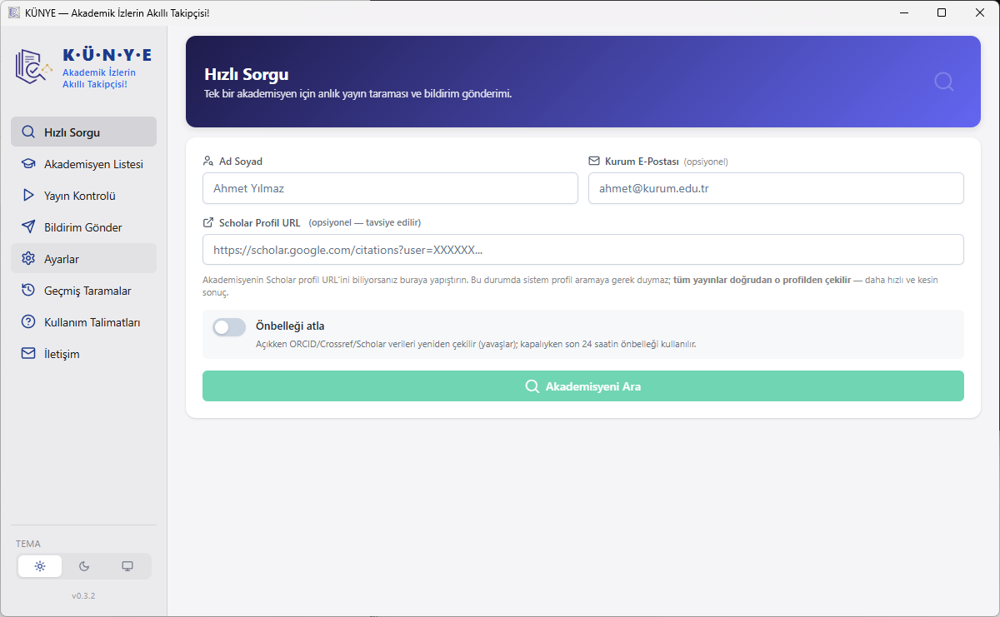

Sol navigasyon menüsü:

| Sayfa | Açıklama |
|-------|----------|
| 🔍 Hızlı Sorgu | Tek akademisyen için anlık sorgulama |
| 🎓 Akademisyen Listesi | YÖKSİS'ten personel çekme ve yönetimi |
| ▶️ Yayın Kontrolü | Toplu tarama başlatma ve izleme |
| 📬 Bildirim Gönder | Mail kuyruğunu önizleme ve gönderim |
| 🕐 Geçmiş Taramalar | Tüm geçmiş tarama kayıtlarına erişim |
| ⚙️ Ayarlar | SMTP, Scholar, proxy ve otomasyon |
| 📖 Kullanım Talimatları | Uygulama içi yardım |
| 📧 İletişim & Destek | Teknik destek formu |

---

### 🔍 Hızlı Sorgu

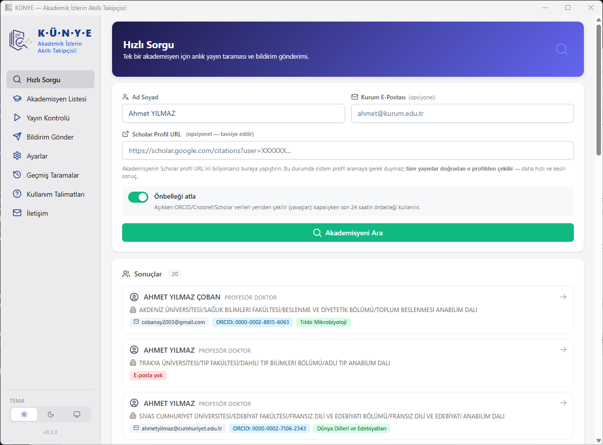

Tek bir akademisyen için anlık yayın taraması yapar.

**Kullanım:**
1. Akademisyenin **Ad Soyad** veya **Scholar Profil URL**'sini girin
2. Kurum e-posta adresini ekleyin (opsiyonel, doğruluk artar)
3. **Akademisyeni Ara** butonuna tıklayın
4. Bulunan adaylar listeden seçilir
5. Tarama otomatik başlar, eksik yayınlar listelenir
6. Hazırlanan bildirim e-postası önizlenip gönderilebilir

**Akıllı Arama Mantığı:**
- Adım 1: `"Ad Soyad KurumKelimesi"` ile dar arama (en doğru)
- Adım 2: ASCII variant ile aynı sorgu (İngilizce profiller için)
- Adım 3: Yalnızca isim ile geniş arama (fallback)

**Scholar Profil Durumları:**
- ✅ **Doğrulanmış** — Profil var, kurumsal e-posta onaylı
- ⚪ **Doğrulanmamış** — Profil var ama e-posta doğrulanmamış
- ❌ **Profil yok** — Scholar'da profil bulunamadı

---

### 🎓 Akademisyen Listesi

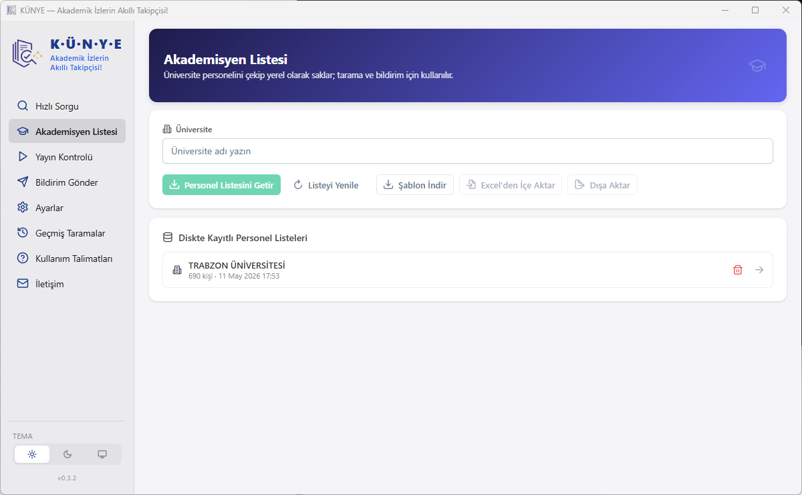

YÖKSİS'ten üniversite personelini çekip yerel olarak saklar.

**Veri Kaynakları:**
- YÖKSİS otomatik çekim (akademik.yok.gov.tr)
- Excel/CSV ile manuel yükleme

**Özellikler:**
- Çekim sırasında anlık akademisyen sayısı: `Akademisyen sayısı: 127 / 700`
- İptal edildiğinde çekilen veriler korunur ve kaydedilir
- Scholar profil URL'leri toplu çözümleme (Scholar Profillerini Bul)
- Satıra tıklayarak düzenleme (e-posta, ORCID, Scholar URL)
- Excel ve CSV olarak dışa aktarma
- Birden fazla üniversite listesi aynı anda saklanabilir
- Liste içi arama ve sıralama

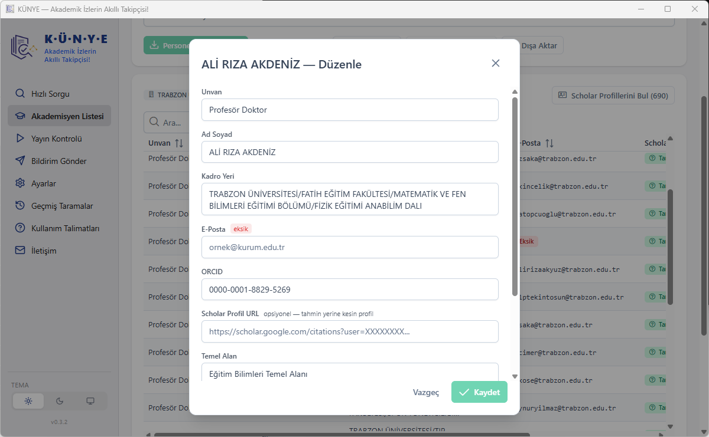

---

### ▶️ Yayın Kontrolü

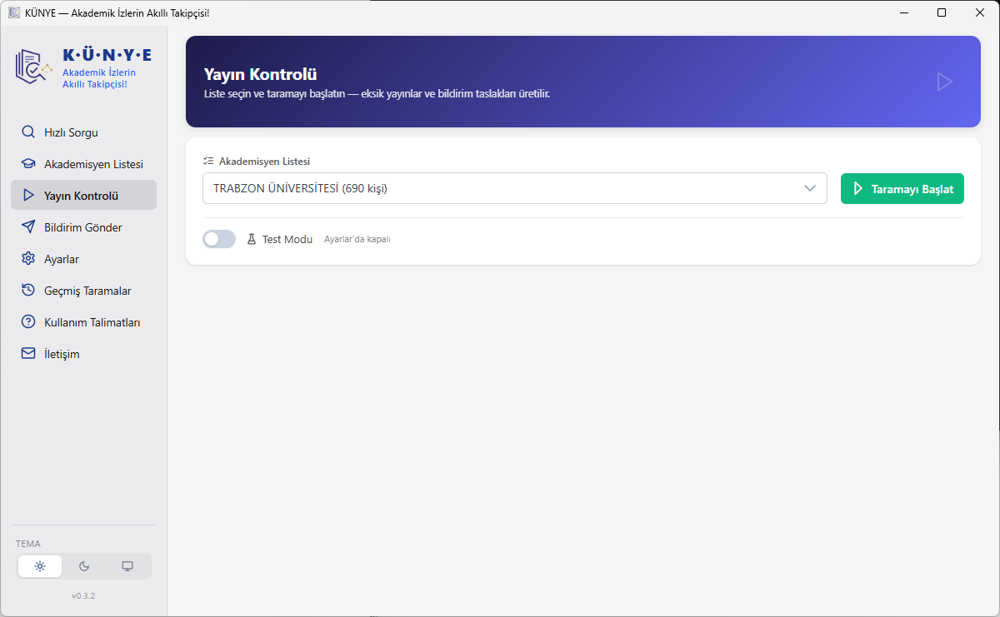

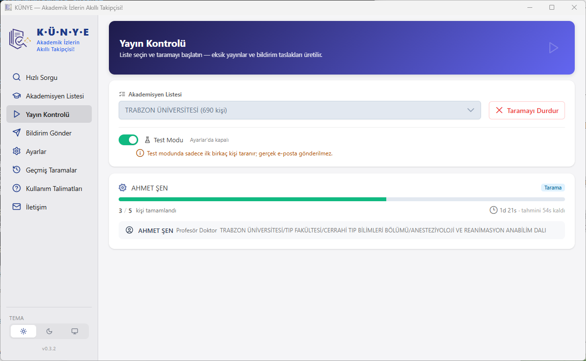

Seçilen akademisyen listesinin tamamı için yayın taraması yapar.

**Tarama Akışı:**
```
Her akademisyen için:
  1. ORCID → yayın listesi
  2. Crossref → yayın verileri
  3. Google Scholar → profil + yayınlar
  4. YÖKSİS ile karşılaştırma
  5. Eksik yayınlar tespit edilir
  6. Kişisel bildirim e-postası hazırlanır
```

**Tarama Özeti:**

| İkon | Alan | Açıklama |
|------|------|----------|
| ✓ | Başarılı | Hatasız işlenen kişi sayısı |
| ✉ | Mail Kuyruğu | Bildirim maili hazırlanan kişi sayısı |
| 🔍 | Scholar Eksik | Profili bulunamayan akademisyen sayısı |
| ⏱ | Süre | Toplam tarama süresi |

**Test Modu:** Gerçek e-posta göndermeden deneme yapılabilir.

---

### 📬 Bildirim Gönder

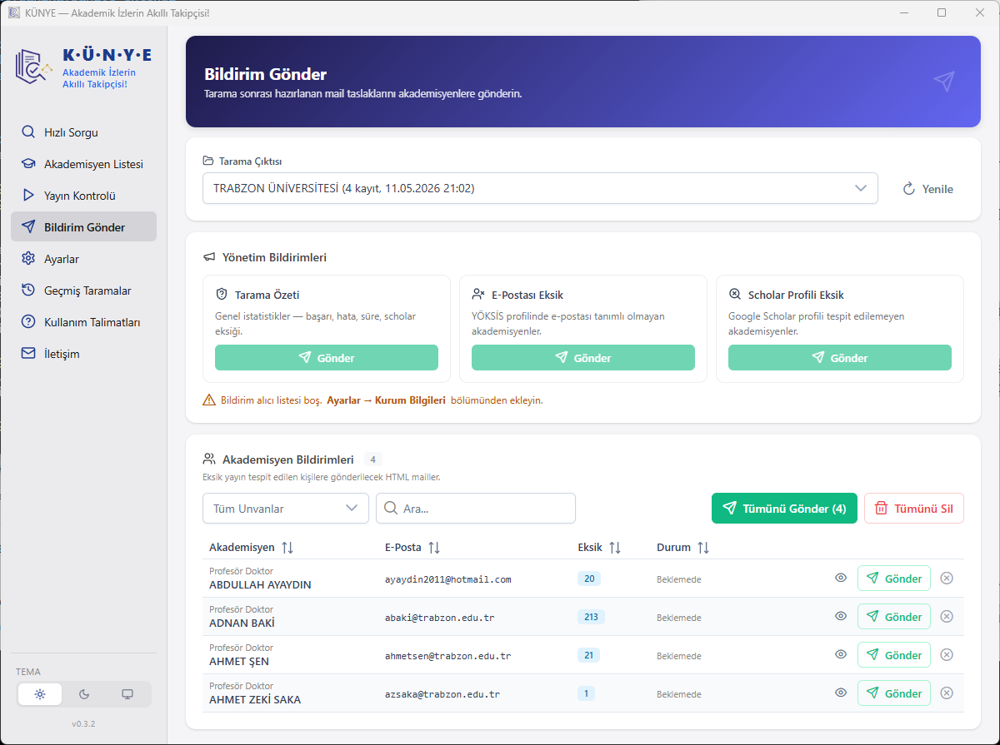

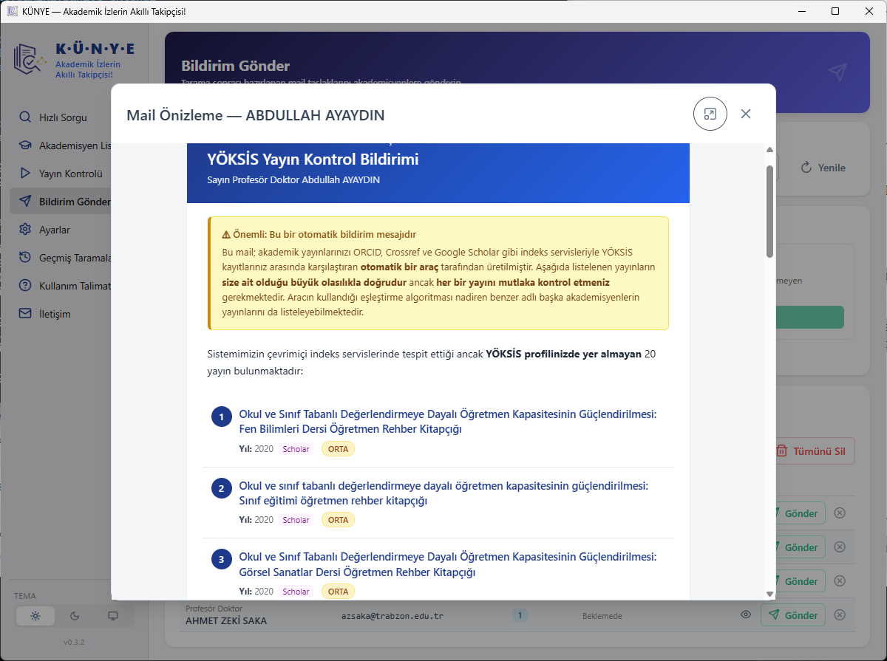

**3 Farklı Mail Şablonu:**

| Durum | Mail İçeriği |
|-------|-------------|
| Doğrulanmış profil | Eksik yayınların kişiselleştirilmiş listesi |
| Doğrulanmamış profil | Kurumsal e-posta onaylama daveti + varsa eksik yayınlar |
| Profil yok | Google Scholar profili oluşturma adım adım rehberi |

**Özellikler:**
- Her akademisyen için HTML önizleme
- Tekil veya toplu gönderim
- Gönderilen mailler işaretlenir (yanlışlıkla tekrar gönderim önlenir)
- Test modu: tüm mailler tek test adresine yönlendirilir

---

### 🕐 Geçmiş Taramalar

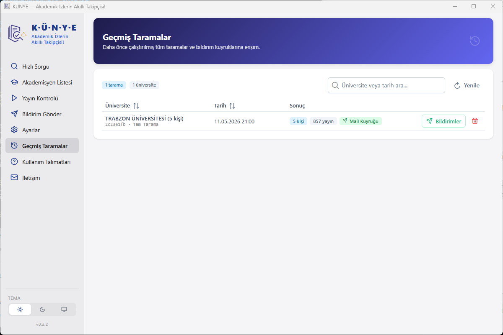

**Özellikler:**
- Tüm taramalar tarih/saat ve üniversite adıyla listelenir
- Her tarama için mail kuyruğuna hızlı erişim
- Excel raporu dışa aktarma
- Hızlı Sorgu ve Tam Tarama kayıtları ayrı etiketlenir
- Şifrelenmiş yerel veritabanında güvenle saklanır

---

### ⚙️ Ayarlar

#### Kurum Bilgileri

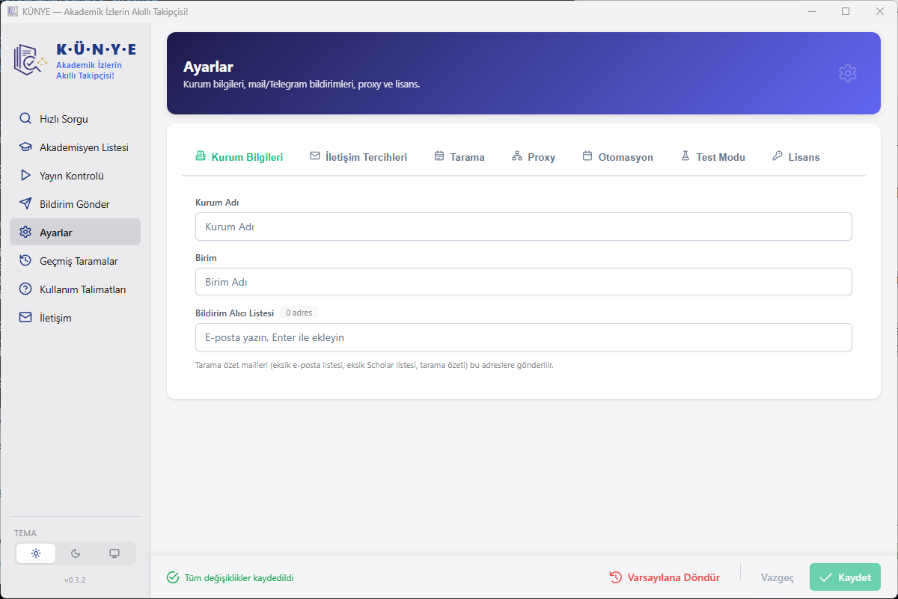

- **Kurum Adı & Birim:** Gönderilen maillerde ve raporlarda gönderici kimliği olarak görünür
- **Bildirim Alıcı Listesi:** Tarama sonu özet mailleri (eksik e-posta listesi, eksik Scholar listesi, tarama özeti) bu adreslere gönderilir

---

#### İletişim Tercihleri (SMTP)

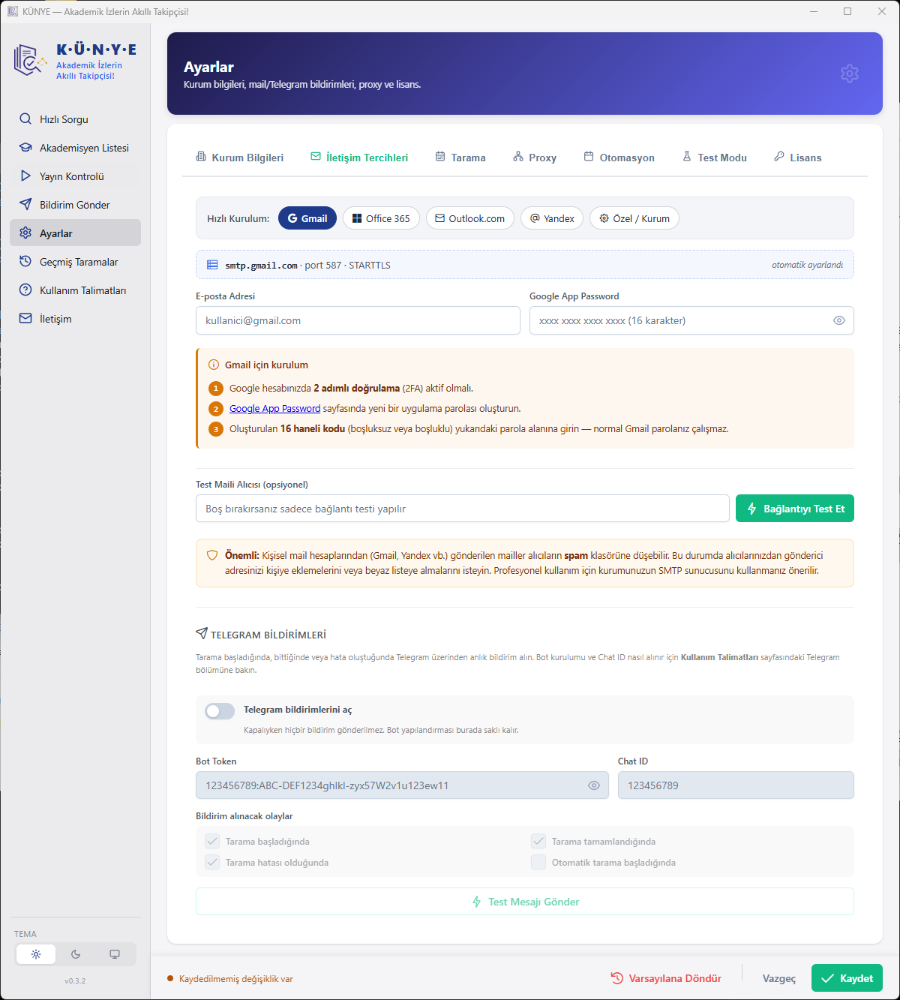

- Hızlı kurulum ön ayarları: **Gmail, Office 365, Outlook, Yandex, Yahoo**
- Özel/kurumsal SMTP sunucusu yapılandırması
- Bağlantı testi + test maili gönderimi
- **Telegram Bildirimleri:** Bot Token + Chat ID ile anlık bildirim (tarama başladı / bitti / hata)

---

#### Tarama (Google Scholar)

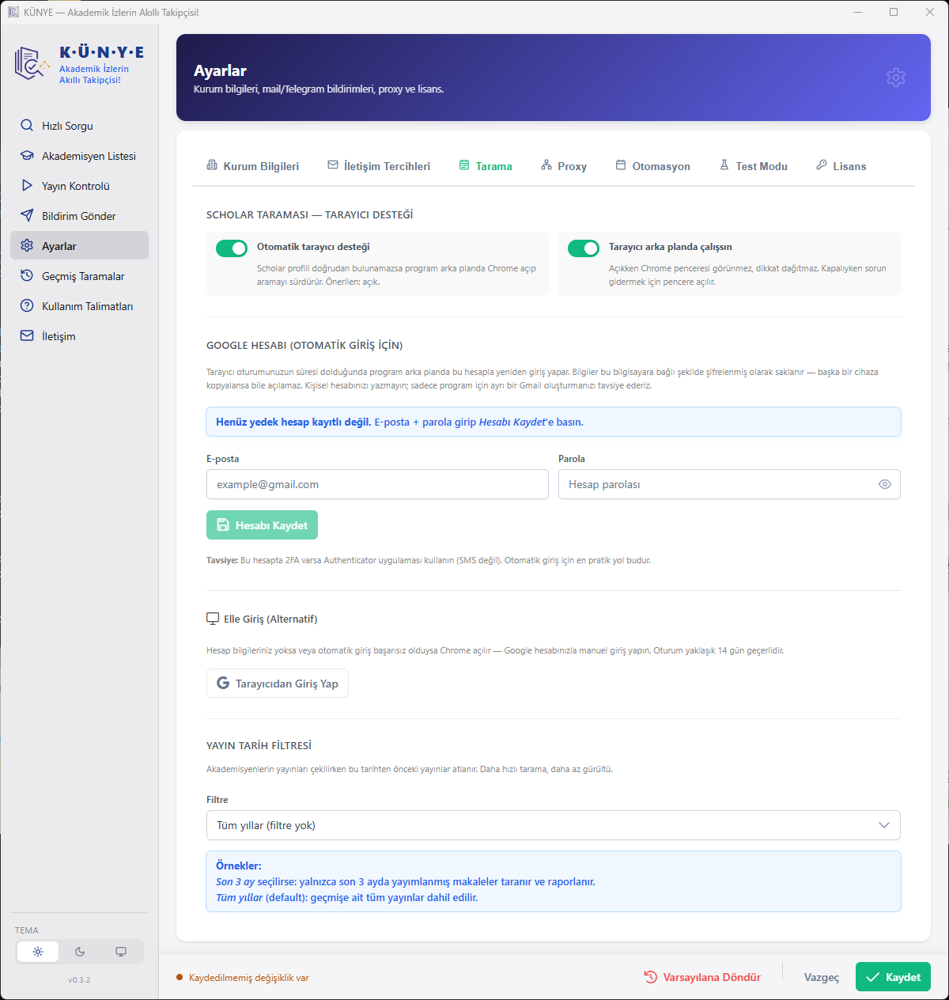

**Google Hesabı (Otomatik Giriş)**

Program, Google Scholar'da arama yapabilmek için bir Google hesabına ihtiyaç duyar. Kişisel hesabınızı kullanmak yerine *program için ayrı bir Gmail oluşturmanız önerilir.*

- E-posta ve parolayı kaydedin → program arka planda headless Chrome ile giriş yapar
- Kimlik bilgileri **makineye bağlı şifreleme** ile saklanır; başka bir bilgisayara kopyalanamaz
- İlk giriş ~28 saniye sürer; oturum yaklaşık 14 gün geçerlidir, sonrasında otomatik yenilenir

**Elle Giriş (Alternatif)**

Yedek hesap yoksa veya otomatik giriş başarısız olursa görünür Chrome penceresi açılır ve kullanıcı manuel olarak giriş yapar.

**Yayın Tarih Filtresi**

Akademisyenlerin yayınları çekilirken bu tarihten önceki yayınlar atlanır:
- Tüm yıllar (varsayılan)
- Son 1 / 3 / 5 yıl
- Özel tarih aralığı

---

#### Proxy

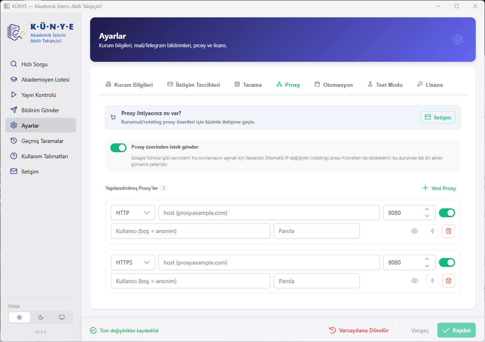

Kurumsal güvenlik duvarı veya Google'ın hız kısıtlamaları nedeniyle Scholar erişimi zorlaşıyorsa proxy kullanılabilir.

**Desteklenen Proxy Türleri:**
- HTTP / HTTPS
- SOCKS5

**Özellikler:**
- Birden fazla proxy tanımlanabilir
- Her proxy için bağlantı testi (yanıt süresi + durum kodu)
- **Round-robin rotasyon:** İstekler proxy'ler arasında sırayla dağıtılır; tek bir IP'nin kısıtlanma riskini azaltır
- Kullanıcı adı/parola ile kimlik doğrulama
- Proxy'ler tekil olarak etkinleştirilebilir/devre dışı bırakılabilir

**Ne Zaman Kullanılır?**
- Scholar, kurumun IP adresini rate-limit uyguladığında
- Kurumsal güvenlik duvarı Google Scholar'ı engellediğinde
- Rotating proxy hizmeti kullanılıyorsa (tek adres yeterlidir)

---

#### Otomasyon

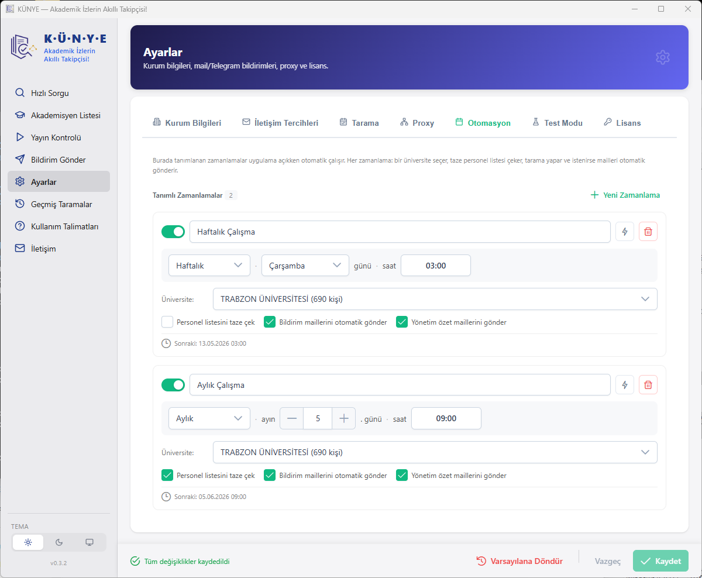

Otomasyon, K·Ü·N·Y·E'nin en güçlü özelliğidir. Bir kez yapılandırıldıktan sonra program **tamamen otomatik** çalışır: personel listesini çeker, yayınları tarar ve eksik bildirimleri gönderir — sizin müdahaleniz gerekmez.

**Zamanlanmış Tarama Nasıl Çalışır?**

```
Program açık olduğu sürece arka planda çalışır:

Zamanlama tetiklenir (örn. her Pazartesi 09:00)
    ↓
1. YÖKSİS'ten taze personel listesi çekilir (opsiyonel)
    ↓
2. Her akademisyen için ORCID + Crossref + Scholar taranır
    ↓
3. Eksik yayınlar tespit edilir
    ↓
4. Kişiye özel bildirim mailleri hazırlanır
    ↓
5. Mailler otomatik gönderilir (opsiyonel)
    ↓
6. Yönetim özet maili gönderilir (opsiyonel)
```

**Zamanlama Seçenekleri:**

| Sıklık | Örnek Kullanım |
|--------|----------------|
| **Günlük** | Her gün belirli saatte tarama |
| **Haftalık** | Her Pazartesi sabahı tarama |
| **Aylık** | Ayın belirli günü tarama |

Her zamanlama için bağımsız yapılandırma:

| Ayar | Açıklama |
|------|----------|
| **Üniversite** | Hangi akademisyen listesi taransın |
| **Personel listesini taze çek** | Açıksa tarama öncesi YÖKSİS'ten güncel liste indirilir |
| **Bildirimleri otomatik gönder** | Hazırlanan mailler onay beklemeden gönderilir |
| **Özet mailini gönder** | Tarama sonucu yönetim adreslerine özet iletilir |

**Pratik Senaryo:**

> Bir üniversite, her ay başında tüm akademisyenlerinin Scholar profillerini kontrol etmek ve eksik yayın bildirimi göndermek istiyor.
>
> **Yapılandırma:** Aylık zamanlama → ayın 1. günü 08:00 → personel listesi taze çek: ✓ → bildirimleri otomatik gönder: ✓ → özet mailini gönder: ✓
>
> **Sonuç:** Her ay 1'inde program uyku modundan uyanır, YÖKSİS'ten güncel listeyi çeker, tüm akademisyenleri tarar, eksik yayınları tespit eder, kişisel mailleri gönderir ve birim müdürüne özet iletir — hiçbir manuel işlem gerekmez.

**Önemli Notlar:**
- Otomasyon yalnızca program açık olduğunda çalışır
- Zamanlama geldiğinde program kilitli ekranda dahi arka planda çalışmayı sürdürür
- Her zamanlamanın son çalışma tarihi ve durumu (başarılı/hata) izlenebilir
- Bir zamanlama sırasında hatayı Telegram bildirimi ile anlık alabilirsiniz

---

#### Test Modu

- Tüm bildirimler tek test adresine yönlendirilir (gerçek akademisyenlere gitm)
- Kişi sayısı sınırı (örn. ilk 5 kişi)
- Şablonları ve SMTP ayarlarını test etmek için idealdir

---

#### Lisans

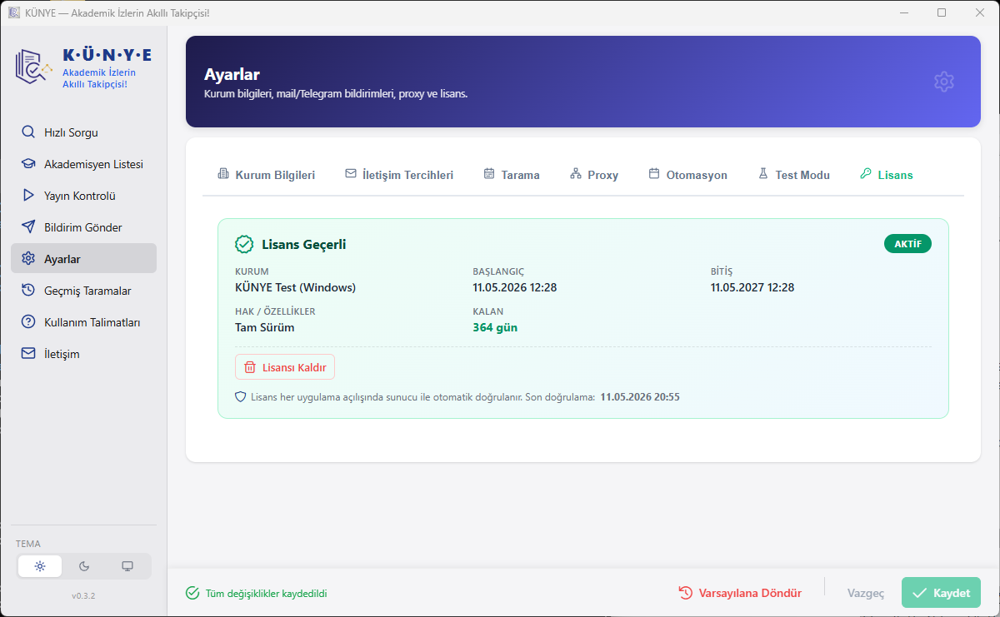

- Lisans aktivasyonu (seri numara + kayıtlı e-posta)
- Aktif lisans bilgileri: kurum, başlangıç/bitiş tarihi, kalan gün
- Bilgisayar kimliği (lisans transferi için gerekli)
- Otomatik sunucu doğrulaması (her açılışta)
- Süresi yaklaşınca uyarı bandı (30 gün → turuncu, 7 gün → kırmızı)

---

## 🔐 Güvenlik & Gizlilik

| Veri | Saklama Yöntemi |
|------|----------------|
| Tarama sonuçları | Şifrelenmiş SQLite (Fernet/AES-128) |
| SMTP şifresi | Makineye bağlı şifreleme |
| Scholar hesabı | Makineye bağlı şifreleme |
| Akademisyen listesi | Yerel JSON (sadece kendi bilgisayarınızda) |

- Hiçbir akademisyen verisi dış sunucuya gönderilmez
- Şifreler başka bir bilgisayarda açılamaz

---

## 🗂️ Veri Konumları

```
C:\Users\...\AppData\Roaming\Künye\
  ├── sidecar-config\
  │   └── settings.json        ← Uygulama ayarları
  ├── cache\
  │   ├── personel\            ← Akademisyen listeleri
  │   ├── api_cache\           ← API yanıt önbelleği
  │   ├── chrome_profile\      ← Scholar Chrome profili
  │   └── raporlar.db          ← Şifreli tarama geçmişi
  └── logs\
      └── sidecar.log          ← Uygulama logları
```

---

## 📊 Teknik Mimari

```
┌──────────────────────────────────────────┐
│              Electron 42                  │
│  ┌────────────────────────────────────┐  │
│  │       Vue 3 + PrimeVue 4 UI        │  │
│  └───────────────┬────────────────────┘  │
│                  │ JSON-RPC / stdio       │
│  ┌───────────────▼────────────────────┐  │
│  │   Python 3.12 Sidecar (PyInstaller) │  │
│  │  ┌──────┐ ┌──────────┐ ┌────────┐ │  │
│  │  │ORCID │ │ Crossref │ │YÖKSİS  │ │  │
│  │  └──────┘ └──────────┘ └────────┘ │  │
│  │  ┌──────────────────────────────┐  │  │
│  │  │  Google Scholar              │  │  │
│  │  │  (undetected-chromedriver)   │  │  │
│  │  └──────────────────────────────┘  │  │
│  └────────────────────────────────────┘  │
└──────────────────────────────────────────┘
```

- **Frontend:** Vue 3, PrimeVue 4, Vite, Pinia
- **Backend:** Python 3.12, PyInstaller
- **Veritabanı:** SQLite (Fernet şifreli)
- **Scholar:** undetected-chromedriver, UC headless

---

## ❓ Sık Sorulan Sorular

**Scholar profili neden bulunamıyor?**  
Ayarlar → Google Hesabı bölümünden yedek bir Gmail hesabı tanımlayın. Program arka planda headless Chrome ile giriş yaparak arama yapar. İlk giriş ~28 saniye sürebilir; sonraki aramalar bu oturumu kullanır.

**Mail spam klasörüne düşüyor**  
Kişisel Gmail/Yandex hesapları yerine kurumsal SMTP kullanın. Alıcılarınızdan gönderici adresini beyaz listeye almalarını isteyin.

**Akademisyen listesi Yayın Kontrolü'nde görünmüyor**  
Önce Akademisyen Listesi sayfasından ilgili üniversiteyi çekin veya Excel'den yükleyin.

**Otomasyon çalışmıyor**  
Programın açık olması gerekir. Zamanlanmış taramalar yalnızca uygulama çalışırken tetiklenir.

**Lisans başka bilgisayara nasıl aktarılır?**  
Lisanslar makineye bağlıdır. Transfer için Ayarlar → Lisans ekranındaki Bilgisayar Kimliği'ni satıcınıza iletin.

**İptal edince veriler korunuyor mu?**  
Evet. Akademisyen listesi çekimi iptal edildiğinde, o ana kadar çekilen akademisyenler cache'e kaydedilir.

---

## 📞 Destek

Sorun bildirimi ve öneriler için uygulama içindeki **İletişim & Destek** sayfasını kullanın.  
Sistem bilgileri (OS, sürüm, makine ID) otomatik olarak maile eklenir.

---

*K·Ü·N·Y·E — Akademik İzlerin Akıllı Takipçisi*
